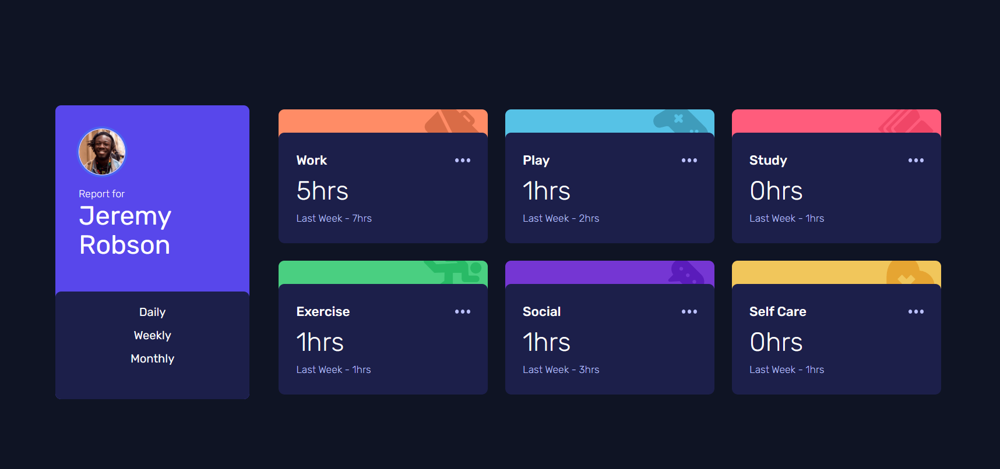
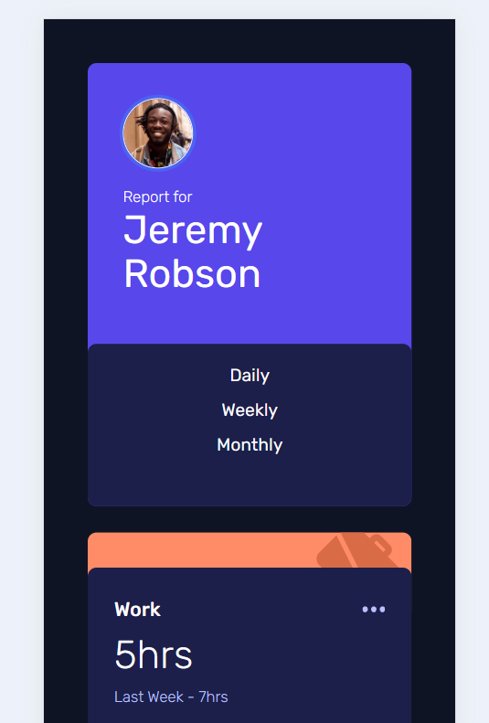

# Time Tracking Dashboard Laura Dev

This solo project Time Tracking Dashboard involved using TypeScript, TailwindCSS, interactive components and modern responsive design.

## Table of contents

- [Overview](#overview)
  - [Screenshots](#screenshots)
  - [Links](#links)
- [My process](#my-process)
  - [Built with](#built-with)
  - [What I learned](#what-i-learned)
  - [Continued development](#continued-development)
  - [Useful resources](#useful-resources)
- [Author](#author)

## Overview

Your users should be able to:

- Switch between viewing Daily, Weekly, and Monthly stats
- View the optimal layout for the site depending on their device's screen size
- See hover states for all interactive elements on the page

## Screenshots

Desktop Version:

Mobile Version:

## Links

- Live Site URL: [Time Tracking Dashboard Website Laura Dev](https://time-tracking-dashboard-lauradev.netlify.app/)
- Frontend Mentor URL Solution: [Frontend Mentor Laura Dev Solution](https://www.frontendmentor.io/solutions/responsive-time-tracking-table-with-typescript-tailwindcss-_0Z11-Q9oA)

## My Process

The time tracking dashboard was foccused on utlizing TypeScript and TailwindCSS for styling. I began by downloading all the relevant design files and thoroughly reviewing the material. I created a Github Repo, installed TypeScript and TailwindCSS. I then added the assets file and configured TailwindCSS with the appropriate Google Fonts, colors and font sizes.

My intial step was to undersstand the structure of the files before diving into the styling. My goal was to create reusable components that could easily be updated. Intially, I created several components such as Card, Profile, Daily, Monthly and Weekly. Each component was designed to organize the content and data effectively.

As the project progressed, I realized that it would be better to use the data.json file that was provided and write javascript to display the information. This required me to start over by importing the data file. I integrated the Profile component code into the App.tsx file to serve as the main application. Orginally, I had a browser router navigation to display the data, but this did not provide a seamless experienced I desired with button clicks. As a result, I streamlined the project to only two TypeScript files. This refractoring of the code made the project more seamless and user-friendly. Thanks to the up front work in streamlining the process, adding the mobile responsiveness at the end was straightforward.

This was my first application using TypeScript, and I became familiar with declaring interfaces for variables/props. I was able to gain a deeper understanding off creating interactive sections in the application.

## Built with

- Typescript
- TailwindCSS
- Google Fonts
- Github

## What I learned

I reinforced and learned a lot of new things during this project. Some of things that were more relevant:

1. **_TailwindCSS Setup_** - I found that I had issues in the beginning with my TailwindCSS setup. Through the debugging process, I was able to learn that the plugins field in the tailwindcss config file needed to be an empty array. I had it with {} instead of []. The plugins field needs to hold a list of plugins that extends Tailwind's functionality.
2. **_Concurrently dev script_** - Concurrently is a command-line tool that allows multiple commands to run in a single terminal window. It allows the application to run multiple processes at the same time. 
3. **_Reusable Components_** - I worked a lot more on the reusable components aspect - trying to make one component that could be used for all the card sections. I was able to learn about passing down props for styling and using Typescript.

## Continued development

I want to continue to learn more about TypeScript and apply it to other projects I'm working on. I found the overlay design aspect to be challenging; therefore, I want to work on the z-index tailwindCSS styling.

## Useful resources

- [TypeScript](https://www.typescriptlang.org/) - Typescript General Website
- Family: [Rubik](https://fonts.google.com/specimen/Rubik) - Weights: 300, 400, 500

## Author

- Website - [Laura V](www.lauradeveloper.com)
- Frontend Mentor - [@lavollmer](https://www.frontendmentor.io/profile/lavollmer)
- Github - [@lavollmer](https://github.com/lavollmer)